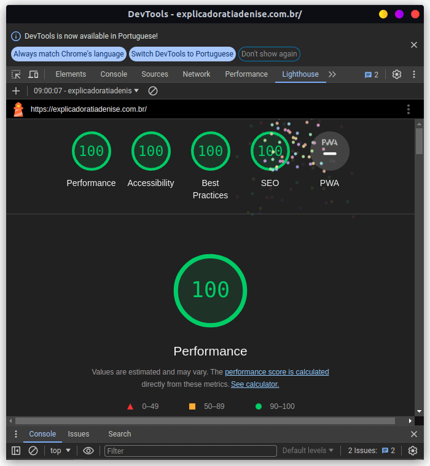
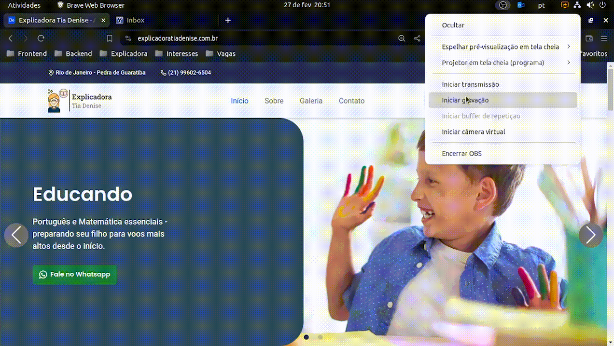

<div align="center">

</div>

<hr>

<p align="center">
   
</p>

### Tópicos 

- [Descrição do projeto](#descrição-do-projeto)

- [Funcionalidades](#funcionalidades)

- [Aplicação](#aplicação)

- [Ferramentas utilizadas](#ferramentas-utilizadas)

- [Acesso ao projeto](#acesso-ao-projeto)

- [Abrir e rodar o projeto](#abrir-e-rodar-o-projeto)

- [Histórico de versões](#historico-de-versoes)

- [Desenvolvedores](#desenvolvedores)

## Descrição do projeto 

<p align="justify">
 
Site da Explicadora Tia Denise, desenvolvido com a biblioteca React e seu FrameWork NextJS, com o objetivo de divulgar sobre seu serviço de reforço escolar e que consigam buscar com o mecanismo de pesquisa do Google. O projeto possui páginas como a de <strong>Ínicio</strong>, <strong>Sobre</strong>, <strong>Galeria</strong> e <strong>Contato</strong>.

O site permite conhecer a Explicadora da professora Tia Denise, onde oferece aulas de reforço do maternal até todo o Ensino Fundamental e visitar os benefícios que leva a um aluno optar por escolher a explicadora, além de conhecer seus serviços educacionais. 

Conta também com uma parte de contato onde é possível entrar em contato a partir de um link para o Whatsapp ou formulário para que clientes consigam se comunicar e tirar possíveis dúvidas atráves do e-mail.


<br/>

</p>

## Funcionalidades

:heavy_check_mark: `Funcionalidade 1:` Envio de e-mails de forma automática, sendo personalizado em duas partes: do <strong>usuário</strong> e do <strong>administrador</strong>. 

:heavy_check_mark: `Funcionalidade 2:` Conexão com Google Analytics.

## Aplicação

<div align="center">


</div>


## Ferramentas utilizadas

        
###

## Acesso ao projeto

https://explicadoratiadenise.com.br/

Você pode [acessar o código fonte do projeto](https://github.com/jorgeguedess/nextjs-explicadora) ou [baixá-lo](https://github.com/jorgeguedess/nextjs-explicadora/archive/refs/heads/main.zip).


## Abrir e rodar o projeto

> Caso você seja um desenvolvedor, use as instruções abaixo para instalar as dependências e sugerir alterações para a aplicação.

É possível verificar o conteúdo de cada versão, selecionando a *branch* específica e o histórico de [commits].

Após baixar o projeto deste repositório, dentro do diretório do projeto você deve usar o comando `npm install` em um terminal, para gerar a pasta **node_modules**.
```sh
npm install
```
Concluída a instalação das dependências do projeto, use o comando `npm run dev` para visualizar a aplicação na porta [localhost:3000](http://localhost:3000).
```sh
npm run dev
```
A página irá recarregar a cada alteração feita no código e mostrará eventuais erros no console.

É recomendado que você use o comando `npm run build` antes de fazer um *commit*, para verficar a ocorrência de erros na aplicação e garantir o deploy da aplicação.
```sh
npm run build
```

## Historico de versoes

Clique nas versões abaixo, para observar a evolução do projeto ao longo do tempo.

| Versão | Update |
| ------ | ------ |
| [Versão 0.0](https://nextjs-explicadora-1j1t6gysn-jorge-guedes.vercel.app/) | Primeira versão do projeto, apresentada para a Explicadora no dia 26 de Fevereiro de 2024, quando foi publicado oficialmente o site ao ar. |


## Desenvolvedores

| [<br><sub>Jorge Guedes</sub>](https://github.com/jorgeguedess) |   |
| :---: | :---: |
